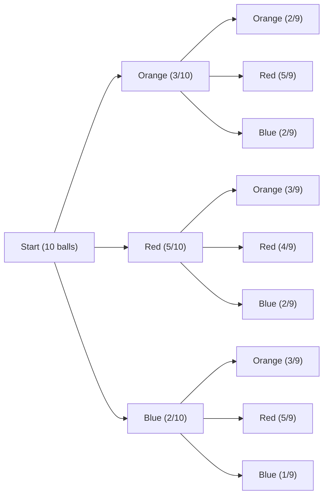

# CH2.3 - Conditional Probability and Independence

This section covers conditional probability and independence. Conditional probability is the probability of an event given that another event has occurred. Independence is when the occurrence of one event does not affect the probability of another event.

---
## Example

> [!Example]
> $$ p(A|B) = \frac{p(A \cap B)}{p(B)} $$

This probability is an Intersection and joint probability, think of multiply, but only if you can answer the following question.

---

## Independence

> [!question]
> Are the events **Independent** of each other?

**Independent** - the outcome of one event does not effect the probability of the other event

Here are some examples of independent events:

> [!Example] **Independent Events**
>
> - spin a roulette wheel twice
> - flip a coin twice
> - rolling two dice
> - sampling with replacement

Going back to the question, lets look at the possible answers.

> [!success] Option 1: Yes
> $$ p(A \cap B) = p(A) \times p(B) $$
> $$ p(Ace \cap nAce2) = p(Ace) \times p(Ace2) $$
> $$ p(A \cap B) = \frac{4}{52} \times \frac{4}{52} $$

> [!failure] Option 2: No
> $$ p(A \cap B) \neq p(A) \times p(B) $$
> $$ p(Ace \cap nAce2) \neq p(Ace) \times p(Ace2) $$
> $$ p(A \cap B) = \frac{4}{52} \times \frac{4}{51} $$

Lets tackle a practice problem now.

---

## Practice Problem

> [!question] Problem
> Mobile telephones perform _handoffs_ as they move from call to cell. During a call, a telephone either performs zero handoffs (**0**), one handoff (**H1**), or more than one handoff (**H2**). IN addition, each call is either long (**L**), if it last more then three minutes, or brief (**B**). We have the following table that represents the data, a sample of 100 calls:
>
> |           | H0  | H1  | H2  | Row Total |
> | --------- | --- | --- | --- | --------- |
> | L         | 10  | 10  | 20  | 40        |
> | B         | 40  | 10  | 10  | 60        |
> | Col Total | 50  | 20  | 30  | n=100     |

**Research Question**: Are _lengths_ and _handoffs_ Independent of Each Other?

1. **Marginal Distributions**

> [!info] Length
> Probability of a Long Call
> $$ p(L) = \frac{40}{100} = 0.4 $$
> Probability of a Brief Call
> $$ p(B) = \frac{60}{100} = 0.6 $$

> [!info] Handoffs
> Probability of Zero Handoffs
> $$ p(H0) = \frac{50}{100} = 0.5 $$
> Probability of One Handoff
> $$ p(H1) = \frac{20}{100} = 0.2 $$
> Probability of More than One Handoff
> $$ p(H2) = \frac{30}{100} = 0.3 $$

2.

3. **Conditional Distributions**

Condition in a level for one categorical variable given the level of another categorical variable.

Calculating for the following probabilities:

- Probability of Zero Handoffs given a Long Call

> [!info] P ( \* | L)
> $$ p(H0|L) = \frac{10}{40} = 0.25 $$
> $$ p(H1|L) = \frac{10}{40} = 0.25 $$
> $$ p(H2|L) = \frac{20}{40} = 0.5 $$

- Probability of Zero Handoffs given a Brief Call

> [!info] P ( \* | B)
> $$ p(H0|B) = \frac{40}{60} = 0.67 $$
> $$ p(H1|B) = \frac{10}{60} = 0.17 $$
> $$ p(H2|B) = \frac{10}{60} = 0.17 $$

- Probability of a Long Call given Zero Handoffs

> [!info] P ( \* | H0)
> $$ p(L|H0) = \frac{10}{50} = 0.2 $$
> $$ p(B|H0) = \frac{40}{50} = 0.8 $$

- Probability of a Brief Call given Zero Handoffs

> [!info] P ( \* | H1)
> $$ p(L|H1) = \frac{10}{20} = 0.5 $$
> $$ p(B|H1) = \frac{10}{20} = 0.5 $$

- Probability of a Long Call given More than One Handoff

> [!info] P ( \* | H2)
> $$ p(L|H2) = \frac{20}{30} = 0.67 $$
> $$ p(B|H2) = \frac{10}{30} = 0.33 $$

**Bringing it all together, let's calculate the following:**

> [!success] Final Calculations
> $$ P(L) = 0.4 $$
> $$ P(B) = 0.6 $$

### Segmented Bar Chart with Matplotlib

```python
import micropip
await micropip.install("matplotlib")
await micropip.install("numpy")

import numpy as np
import matplotlib.pyplot as plt

# define the data
# bar Chart
N = 3
ind = np.arange(N)  # the x locations for the groups
width = 0.35       # the width of the bars

p1 = plt.bar(ind, (0.25, 0.67, 0.67), width, color='r')
p2 = plt.bar(ind, (0.25, 0.17, 0.17), width, color='b', bottom=(0.25, 0.67, 0.67))
p3 = plt.bar(ind, (0.5, 0.17, 0.17), width, color='g', bottom=(0.5, 0.17, 0.17))

# add some text for labels, title and axes ticks
plt.ylabel('Probability')
plt.title('Probability by Length and Handoff')
plt.xticks(ind, ('H0', 'H1', 'H2'))
plt.yticks(np.arange(0, 1.1, 0.1))
plt.legend((p1[0], p2[0], p3[0]), ('L', 'B', 'H2'))

# Display the chart
plt.show()
```

![[Screenshot 2024-09-12 at 10.44.38 AM.png]]

**Either:**

Conditionals are _not similar_ to marginals, there is an association between the two, and thus, not independent.

**Or:**

Conditionals are _Similar_ to Marginals, there is no association between the two, and thus, independent.

---

## Showing Mathematically: are two events independent

Lets find a random combination from that table and determine if they are independent.

> [!question]
> Are L and H0 independent of each other?
> $$ p(L \cap H0) = p(L) \times p(H0) $$
> $$ 10/100 = (\frac{40}{100}) \times (\frac{50}{100}) $$

Therefore, $P(L \cap H0)$ is $\color{red}{not\ independent}$

---

## Example - Independence

> [!example]
> If you own two cars, what is the probablity that:
>
> - neither will need repair?
> - both will need repair?
> - at least one car will need repair?

### Probability table

| X   | p(x) |
| --- | ---- |
| 0   | .72  |
| 1   | .17  |
| 2   | .07  |
| ≥ 3 | .04  |

1. **Neither will need repair**

> [!success] Correct Answer
> $$ P(x1 = 0, x2 = 0) = P(x1 = 0) \times P(x2 = 0) = 0.72 \times 0.72 = 0.5184 $$

2. **Both will need repair**

> [!success] Correct Answer
> $$ P(x1 \ge 1, x2 \ge 1) = P(x1 \ge 1) \times P(x2 \ge 1) = 0.28 \times 0.28 = 0.0784 $$

3. **At least one car will need repair**

> [!success] Correct Answer
> $$ P(x1 \ge 1, x2 \ge 1) = 1 - P(x1 = 0, x2 = 0) = 1 - 0.5184 = 0.4816 $$

## Example - Independence

Classic exmaple: Balls in Urn to Demonstrate Tree Diagrams, Conditional Probability, Joint Probability, and Independence.

> [!example]
> 10 balls in an urn, 3 are orange, 5 are red, and 2 are blue.
> Draw two balls without replacement.

### Mermaid Tree Diagram

The following tree diagram is a visual representation of the problem.



From the tree diagram, we can calculate the following:

1. **Probability of Drawing an Orange Ball**

> [!success] Correct Answer
> $$ P(O) = \frac{3}{10} = 0.3 $$
> $$ P(O) = \frac{2}{9} = 0.2222 $$
> $$ P(O) = \frac{3}{9} = 0.3333 $$

2. **Probability of Drawing a Red Ball**

> [!success] Correct Answer
> $$ P(R) = \frac{5}{10} = 0.5 $$
> $$ P(R) = \frac{5}{9} = 0.5556 $$
> $$ P(R) = \frac{4}{9} = 0.4444 $$

3. **Probability of Drawing a Blue Ball**

> [!success] Correct Answer
> $$ P(B) = \frac{2}{10} = 0.2 $$
> $$ P(B) = \frac{2}{9} = 0.2222 $$
> $$ P(B) = \frac{1}{9} = 0.1111 $$


