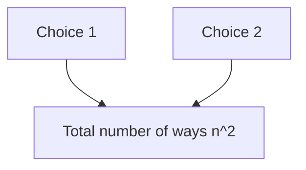

# CH2.2 - Counting Methods

---

So far, S has been small enough that we could list all the outcomes. However, as S grows, it becomes impractical to list all outcomes. We need to develop methods to count the number of outcomes in a sample space.

There are some counting methods that we will use in this chapter:

We will also use the following:

$$ p(A) = \frac{favorable outcomes}{total outcomes} $$

---

## Basic Counting Rule

1. There are n ways to make choice 1.
2. For each of these n ways, there are n ways to make choice 2.

--> **Total number of ways to make both choices is n \* n = n^2**

---

## Permutations

Permutations are arrangements of objects in a specific order, where ordering of "n" objects is important.

$$ P(n,r) = \frac{n!}{(n-r)!} $$

> [!Example] **Permutations Example**
> how many ways can you arrange the letters in the word `math`?

$$ P(4,4) = \frac{4!}{(4-4)!} = 4! = 4 \times 3 \times 2 \times 1 = 24 $$

---

## Combinations

ORDER DOES NOT MATTER

Combinations are selections of objects in which the order of selection is not important.

> [!Example] **Combinations Example**
> 50 students apply for a scholarship. How many ways can 5 students be selected to receive the scholarship?

We can use the combination formula:

$$ C(n,r) = \frac{n!}{r!(n-r)!} $$

And plug in the numbers:

$$ C(50,5) = \frac{50!}{5!(50-5)!} = \frac{50!}{5!45!} = 2118760 $$

---

## Bigger Examples

There are 17 broken lightbulbs in a box of 100 lightbulbs. A random sample of 3 lightbulbs is chosen without replacement.

1. How many ways can the sample be chosen?

> [!success] $$ C(100,3) = \frac{100!}{3!(100-3)!} = 161700 $$

2. How many samples contain no broken lightbulbs?

> [!success] $$ C(83,3) = \frac{83!}{3!(83-3)!} = 91881 $$

3. What is the probability that a sample contains no broken lightbulbs?

> [!success] $$ P(x=0) = \frac{91881}{161700} = .5682 $$
